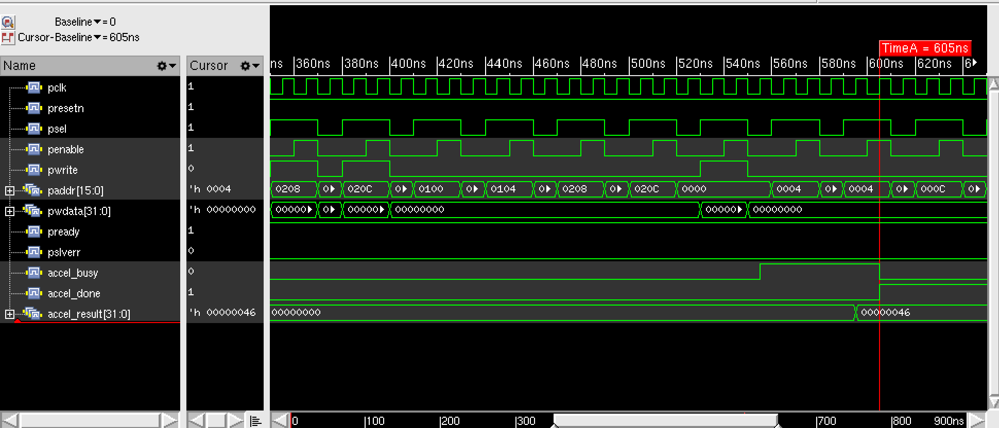
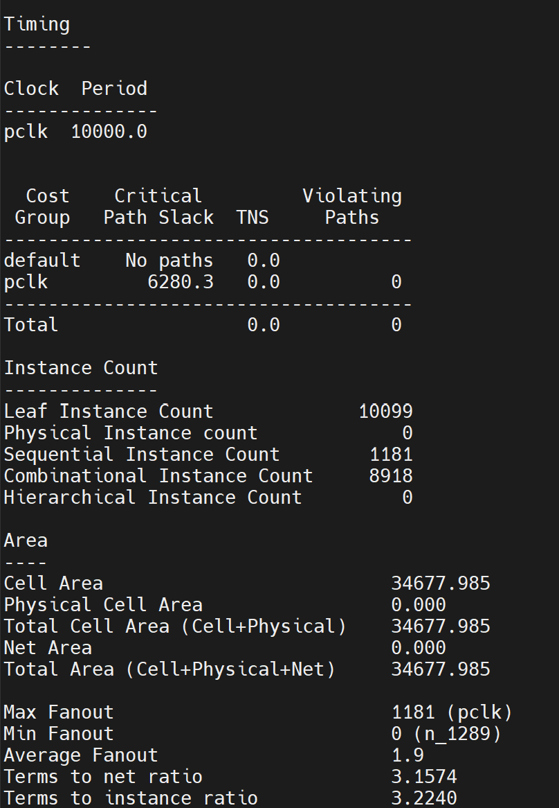
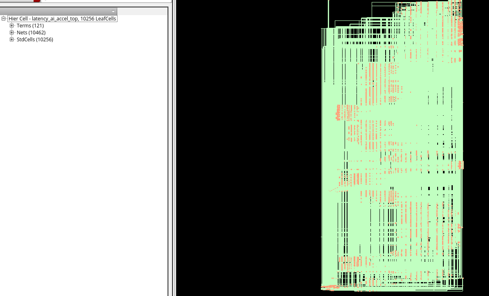
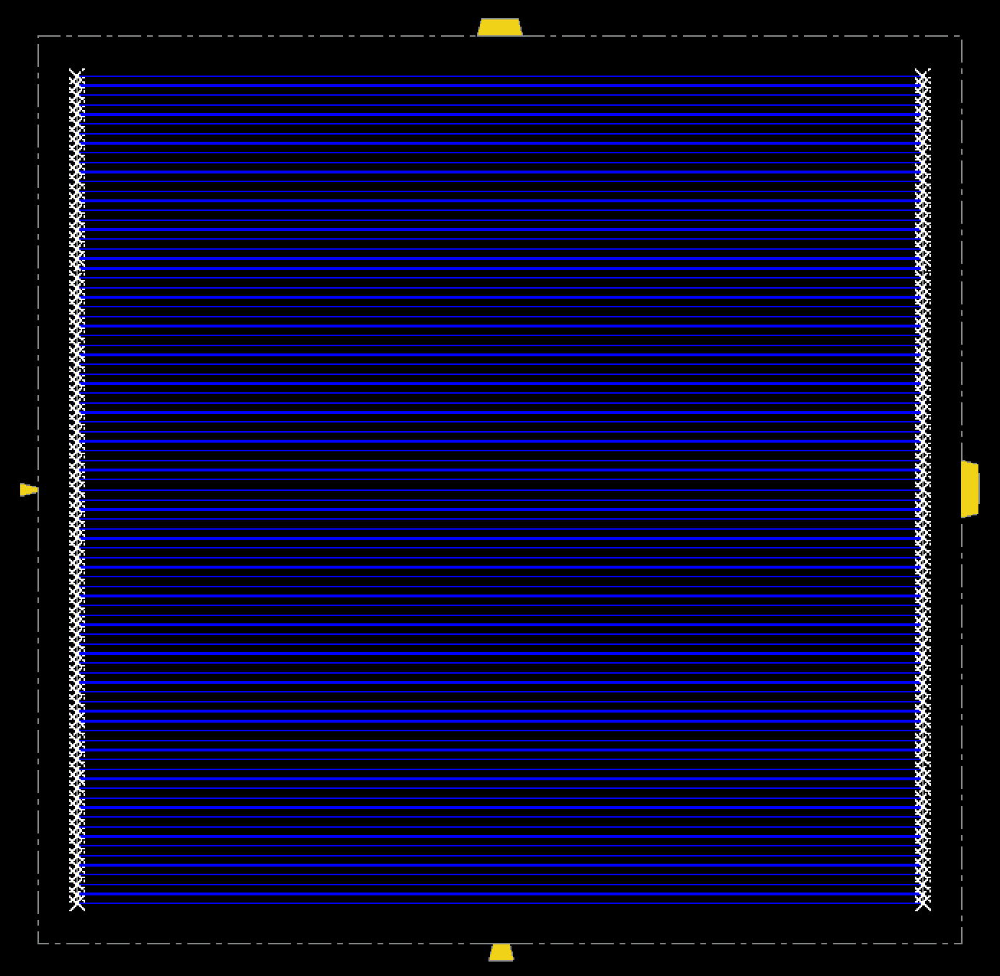
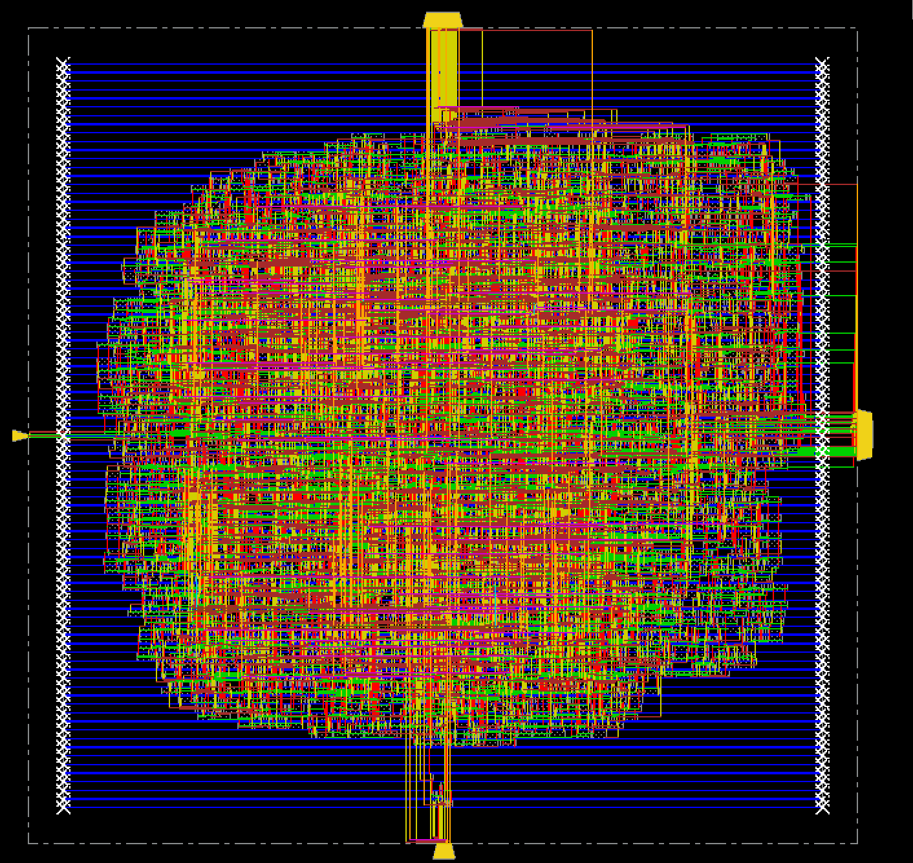
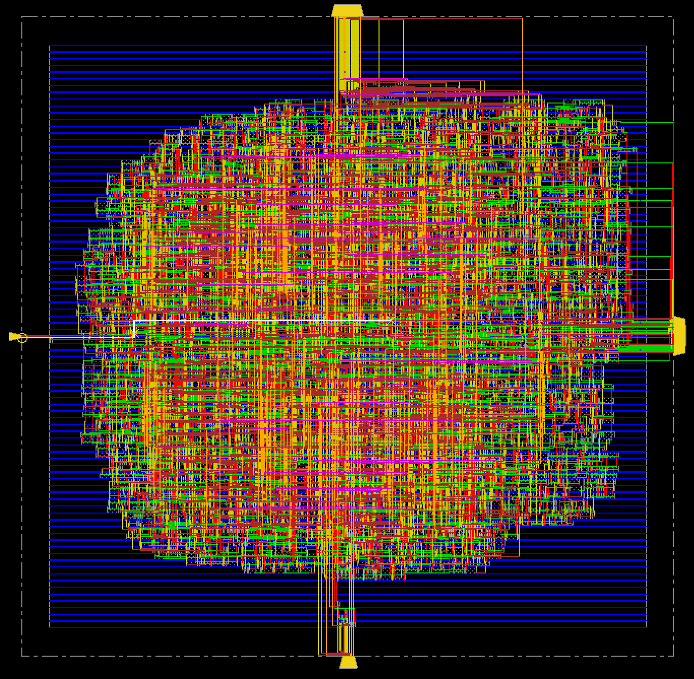
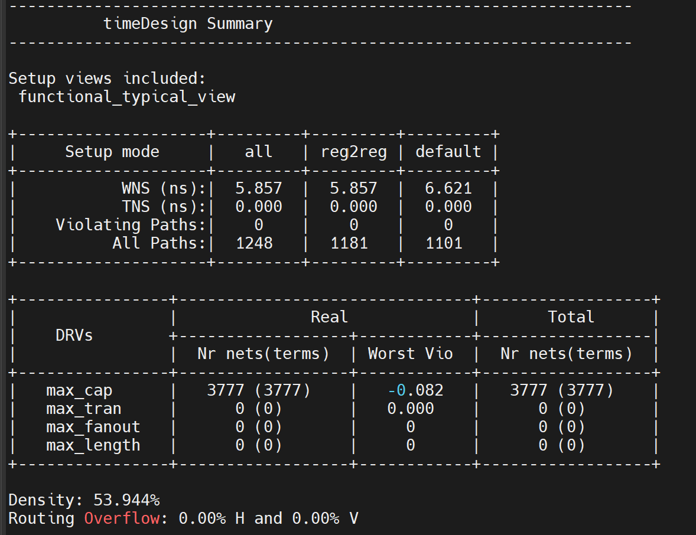
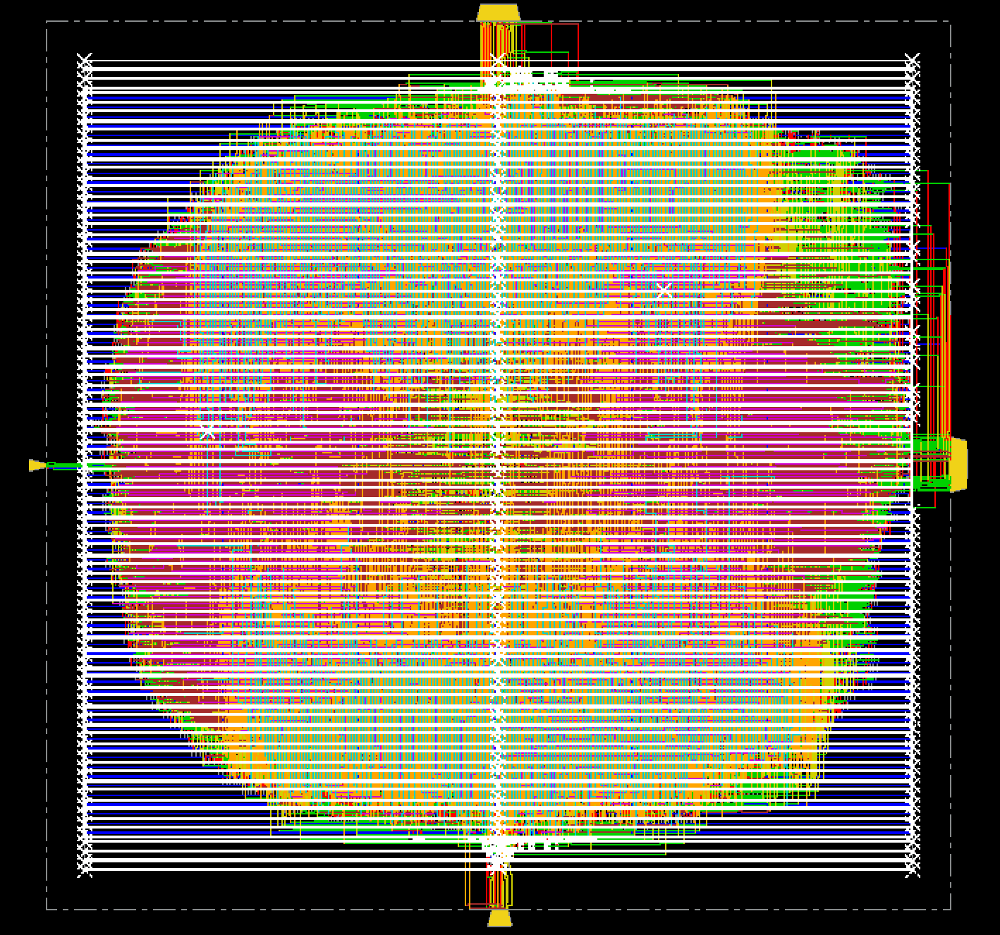
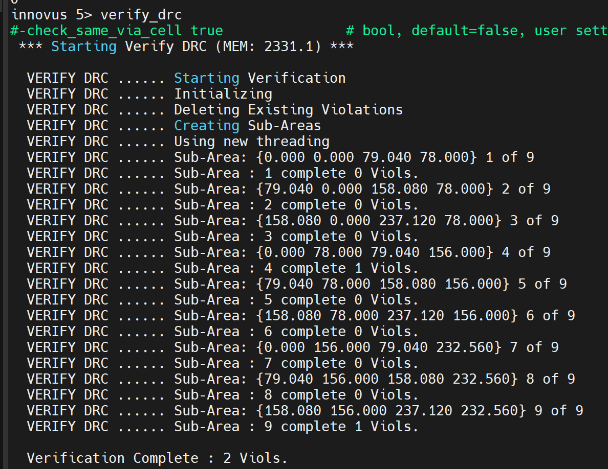

# Latency-Aware INT8 AI Accelerator ASIC

> Cadence Xcelium · Genus 18.1 · Innovus 20.13 · FreePDK45 gscl45nm

---

## Why This Project Exists

Edge AI inference runs into a hard wall: neural network accelerators on FPGAs and GPUs burn power and add latency that real-time systems can't afford. The solution is a custom ASIC with a dedicated MAC datapath, deterministic cycle count, and a lightweight control interface.


---

## Key Results

| Metric | Value |
|---|---|
| Technology | 45nm FreePDK45 (OSU gscl45nm) |
| Standard cells | 10,099 |
| Cell area | 34,678 µm² |
| Die size | 237 × 233 µm |
| Core utilization | 70.8% |
| Target clock | 100 MHz (10 ns period) |
| Post-route setup WNS | **+5.25 ns** (zero violations) |
| Post-route hold WNS | **+43 ps** (zero violations) |
| Total timing paths | 1,248 |
| Total power | 6.1 mW (242 nW leakage + 5.87 mW dynamic) |
| DRC violations (signoff) | 2 (metal6 shorts — CCOpt clock tree, FreePDK45 artefact) |
| RTL simulation | 13/13 tests passed |
| Gate-level simulation | 13/13 tests passed |

---

## Architecture

```
                    APB Bus (pclk, presetn, paddr[15:0], pwdata[31:0])
                              │
                    ┌─────────▼──────────┐
                    │    apb_reg_if       │  ← APB slave decode, config regs
                    │  (FSM controlled)   │     LEN, CTRL, STATUS, CFG_ERROR
                    └────────┬───────────┘
                             │
              ┌──────────────┼────────────────┐
              │              │                │
     ┌────────▼──────┐  ┌───▼──────────┐  ┌─▼──────────────┐
     │  scratchpad   │  │  mac_engine  │  │ bist_controller │
     │  64-entry     │  │  CSA tree    │  │  LFSR/MISR      │
     │  dual-port    │  │  dot-product │  │  self-test      │
     │  SRAM (32b)   │  │  pipeline    │  │                 │
     └───────────────┘  └──────────────┘  └─────────────────┘
                              │
                    accel_result[31:0], accel_done, accel_busy
```

**4 RTL blocks, 5 source files:**

- `apb_reg_if.sv` — APB slave, register map, FSM sequencer. Decodes PADDR, drives PREADY/PSLVERR, controls MAC kickoff and scratchpad access.
- `scratchpad.sv` — 64-entry × 32-bit dual-port register file. Holds A[] and B[] vectors for the MAC engine.
- `mac_engine.sv` — INT8 dot-product engine with Carry-Save Adder (CSA) tree. Accumulates `A[i] × B[i]` over N cycles, outputs 32-bit result. Deterministic 4-cycle latency for length-4 vectors.
- `bist_controller.sv` — Built-In Self Test using LFSR stimulus and MISR signature capture. Catches scratchpad and datapath faults at power-on.
- `latency_ai_accel_top.sv` — Top-level integration.

---

## Design Flow

```
RTL (SystemVerilog)
       │
       ▼
 Xcelium RTL Sim ──────────────────── 13/13 PASS
       │
       ▼
 Genus Synthesis (45nm gscl45nm)
   generic → mapped → incremental opt
       │
       ▼
 Xcelium Gate-Level Sim (GLS) ──────  13/13 PASS
       │
       ▼
 Innovus Physical Design
   floorplan → sroute → place → preCTS
   → CCOpt CTS → postCTS opt
   → NanoRoute → postRoute opt
   → RC extraction → timing signoff
   → DRC → connectivity → GDS out
```

---

## 1. RTL Simulation

**Tool:** Cadence Xcelium 25.09  
**Testbench:** `latency_ai_accel_tb.sv`

6 test scenarios, 13 individual assertions:

| Test | What It Checks |
|---|---|
| TEST 1 | APB LEN register write and readback |
| TEST 2 | Scratchpad A[] and B[] write/readback (4 entries) |
| TEST 3 | MAC dot-product: result correctness + deterministic cycle count |
| TEST 4 | BIST execution and pass-bit assertion |
| TEST 5 | Invalid LEN configuration → `cfg_error` asserted |
| TEST 6 | Invalid APB address → `PSLVERR` asserted |

```
ALL TESTS PASSED.   PASSES: 13   FAILS: 0
Simulation complete at time 935 NS
```


RTL Simulation — MAC Dot-Product Execution:
APB write transactions load vector operands into the scratchpad via psel/penable handshaking across addresses 0x0100–0x020C. The MAC engine asserts accel_busy at ~540 ns when computation begins, pulses accel_done at ~595 ns upon completion, and accel_result settles to 0x00000046 (70 decimal) — the correct INT8 dot-product of A=[1,2,3,4] · B=[4,5,6,7]. All 13 test assertions passed with zero failures.
---

## 2. Logic Synthesis

**Tool:** Cadence Genus 18.1  
**Library:** FreePDK45 OSU gscl45nm (27 combinational + 4 sequential cell types)  
**Constraint:** 10 ns clock (100 MHz), `set_input_delay`, `set_output_delay`, `set_max_fanout`

Genus ran generic synthesis → technology mapping → incremental optimization. The MAC datapath synthesized to a CSA tree (86× FAX1 full adders, 71× HAX1 half adders) — Genus selected the `very_fast` datapath configuration across all 6 DP regions, prioritizing speed over area.

**Gate mix (top contributors):**

| Cell | Count | Area (µm²) | % Total |
|---|---|---|---|
| DFFSR | 1,181 | 12,193 | 35.2% |
| BUFX2 | 3,789 | 8,891 | 25.6% |
| AOI22X1 | 1,168 | 3,837 | 11.1% |
| OAI21X1 | 1,042 | 2,934 | 8.5% |
| NAND2X1 | 1,142 | 2,144 | 6.2% |
| FAX1/HAX1 | 157 | 1,100 | 3.2% |

**Critical path (post-synthesis):** `u_mac_engine_idx_reg[0]/Q → CSA carry chain (63 FAX1 stages) → u_mac_engine_acc_reg[31]/D` — 3,649 ps data path, **6,280 ps slack** on 10 ns clock.

```
Setup WNS : +6.28 ns   TNS : 0.0   Violating paths : 0
Total power: 6.11 mW   (leakage: 243 nW | dynamic: 5.87 mW)
Cell area : 34,678 µm²   Cells: 10,099
Genus runtime: 110 s CPU / 146 s elapsed
```

---

## 3. Gate-Level Simulation (GLS)

**Tool:** Cadence Xcelium 25.09  
**Netlist:** `latency_ai_accel_top_mapped.v` (post-synthesis gate netlist)  
**Library:** `gscl45nm.v` (behavioral cell models with timing)

Same 13-test bench run against the actual mapped gate netlist with SDF back-annotation. Confirms synthesis didn't change functional behavior and that gate-level timing is consistent with the synthesis report.

```
ALL GATE-LEVEL TESTS PASSED.   PASSES: 13   FAILS: 0
Simulation complete at time 900 NS
Design hierarchy: 10,101 instances | 1,209 registers | 16,534 timing checks
```

Quite far view hwoever the orange colored area are the area with higher gate counts
---

## 4. Physical Design (Innovus)

**Tool:** Cadence Innovus 20.13  
**PDK:** FreePDK45 gscl45nm LEF (10-metal layer stack, M1–M10)

### 4a. Floorplan

- Die: **237.12 × 232.56 µm**
- Core margins: 10 µm all sides (adjusted to placement grid: 10.07 µm)
- Core utilization target: **70%** — conservative enough to give the router breathing room without wasting area
- 121 IO pins placed on M3/M4 across all 4 die edges using `editPin` in batch mode:
  - Left: `pclk, presetn, psel, penable, pwrite` (M3)
  - Bottom: `paddr[15:0]` (M4)
  - Right: `pwdata[31:0]`, `accel_result[31:0]`, `accel_busy`, `accel_done` (M3)
  - Top: `prdata[31:0]`, `pready`, `pslverr` (M4)



### 4b. Placement

- `placeDesign` → standard cell placement
- `optDesign -preCTS` → pre-CTS timing optimization
- Post-placement density: **53.8%** (cells spread before CTS buffers are inserted)
- Routing overflow: **0.01% H, 0.00% V** — essentially congestion-free

```
Pre-CTS setup WNS: +5.978 ns   TNS: 0.0   Violating paths: 0
```



### 4c. Clock Tree Synthesis (CTS)

- **Method:** CCOpt (Concurrent Clock and Data Optimization)
- Buffer cells: `BUFX2`, `BUFX4`
- Inverter cells: `INVX1`, `INVX2`, `INVX4`, `INVX8`
- Max routing layer capped at **metal8** via `setNanoRouteMode -routeTopRoutingLayer 8` to prevent clock wires from reaching M9/M10 where DRC violations were unresolvable in earlier iterations
- Clock net `pclk` fans to **1,181 registers** (max fanout in design)

```
Post-CTS setup WNS: +5.857 ns   TNS: 0.0   Violating paths: 0
Routing overflow: 0.00% H and 0.00% V
```




### 4d. Routing

- `routeDesign` — global + detail routing across M1–M8
- Signal nets: 11,373 total | 210,104 metal segments in GDS
- Via instances: 113,317
- Routing distribution: M2 (84k segments, primary H signal layer) → M3 (70k, primary V) → M4–M8 (decreasing)
- Power: `sroute -connect corePin` stitches M1 followpin rails to all 10,019 placed cells

### 4e. Post-Route Optimization and Signoff

RC extraction run in postRoute mode (319,184 resistors, 327,828 ground caps extracted). Delay calculation using full detail RC.

```
Post-route setup:   WNS = +5.246 ns   TNS = 0.0   Violating paths = 0
Post-route hold:    WNS = +0.043 ns   TNS = 0.0   Violating paths = 0
max_tran violations: 0
max_fanout violations: 0
Final cell density: 70.815%
```


### 4f. DRC and Connectivity

```
verify_drc:          2 violations (metal6 shorts — CCOpt clock trunk, FreePDK45 known artefact)
verifyConnectivity:  87 special-wire opens on vdd/gnd (M1 followpin row-boundary artefact, 
                     inherent to coreless FreePDK45 flow — does not affect cell connectivity)
```




---

## Issues Encountered and How They Were Resolved

This section documents the real engineering problems hit during the flow — the kind of things that don't show up in textbook flows but are central to actual ASIC work.

**1. `editPin` crash on Innovus 20.13 (`-unit MICRON` without `-spacing`)**  
The `editPin` command crashed immediately because `-unit MICRON` requires `-spacing` to be specified in that version. Fixed by removing `-unit` entirely and switching to `-spreadType center` without `-spacing`, wrapped in `setPinAssignMode -pinEditInBatch true/false` as Innovus itself recommended in the log.

**2. `pclk` routing graph disconnected (IMPCCOPT-2215)**  
After CCOpt CTS, the `pclk` net had a broken routing graph that caused `optDesign -postRoute` to error out with "route/traversal graph not fully connected." Fixed by deleting the broken route and re-routing `pclk` with `deleteRoute -net pclk` followed by `routeDesign -globalDetail -nets pclk` before post-route optimization.

**3. `set_ccopt_property max_routing_layer` — three iterations to find valid syntax**  
Trying to cap the clock tree at metal8 required working through three invalid API forms across Innovus 20.13 (`route_type -max_routing_layer` → IMPTCM-48, global `max_routing_layer` → IMPCCOPT-2036) before landing on the correct approach: `setNanoRouteMode -routeTopRoutingLayer 8` for the NanoRoute engine, combined with patching the generated `ccopt.spec` with the per-clock-tree `-clock_tree` scoped form.

**4. `addStripe` causing 13,608 DRC violations**  
Adding M6/M7 power stripes before `placeDesign` blocked routing tracks on the two most-used intermediate signal layers. The router then shorted thousands of signal nets against the power mesh. Fixed by removing `addStripe` entirely — FreePDK45 OSU cells use only M1 followpin rails and do not require a power mesh for a coreless design. The `sroute -connect corePin` pass is sufficient.

**5. `addStripe -extend_to coreEdge` — invalid enum**  
`coreEdge` is not a valid value for `-extend_to` in Innovus 20.13. Valid values are `{design_boundary first_padring last_padring all_domains}`. Fixed by replacing with `design_boundary`.

---

## Tool Flow Summary

| Phase | Tool | Version |
|---|---|---|
| RTL simulation | Cadence Xcelium |
| Logic synthesis | Cadence Genus | 
| Gate-level sim | Cadence Xcelium | 
| Physical design | Cadence Innovus | 
| PDK | FreePDK45 OSU | gscl45nm |


---

## Repository Structure

```
.
├── rtl/
│   ├── apb_reg_if.sv          # APB slave + register file + FSM
│   ├── scratchpad.sv           # 64×32b dual-port register file
│   ├── mac_engine.sv           # INT8 CSA-tree dot-product engine
│   ├── bist_controller.sv      # LFSR/MISR built-in self test
│   └── latency_ai_accel_top.sv # Top-level integration
├── tb/
│   └── latency_ai_accel_tb.sv  # RTL testbench (13 tests)
├── gate_sim/
│   └── latency_ai_accel_gate_tb.sv  # GLS testbench (13 tests)
├── synth/
│   ├── genus_synth.tcl         # Genus synthesis script
│   ├── constraints.sdc         # SDC timing constraints
│   └── outputs/                # Mapped netlist + SDC
├── innovus/
│   ├── run_innovus.tcl         # Full PnR script
│   ├── innovus_init.tcl        # Design variables
│   ├── mmmc.tcl                # MMMC view definitions
│   ├── reports/                # All signoff reports
│   ├── outputs/                # DEF, netlist, GDS
│   └── db/                     # Innovus design databases (01–04)
└── README.md
```

